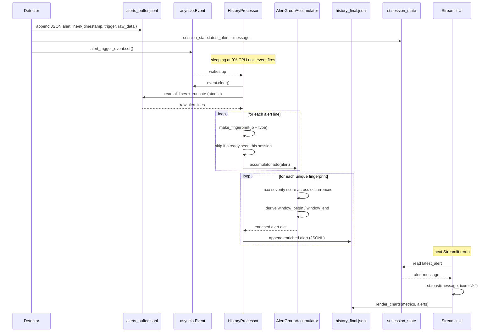

```mermaid
%%{init: { "theme": "default", "themeCSS": "svg { background: white !important; }" }}%%

sequenceDiagram

    participant Det as Detector

    participant Buf as alerts_buffer.jsonl

    participant Ev as asyncio.Event

    participant HP as HistoryProcessor

    participant Score as AlertGroupAccumulator

    participant Hist as history_final.jsonl

    participant SS as st.session_state

    participant UI as Streamlit UI

    Det->>Buf: append JSON alert line\n{ timestamp, trigger, raw_data }

    Det->>SS: session_state.latest_alert = message

    Det->>Ev: alert_trigger_event.set()

    Note over HP: sleeping at 0% CPU until event fires

    Ev-->>HP: wakes up

    HP->>Ev: event.clear()

    HP->>Buf: read all lines + truncate (atomic)

    Buf-->>HP: raw alert lines

    loop for each alert line

        HP->>HP: make_fingerprint(ip + type)

        HP->>HP: skip if already seen this session

        HP->>Score: accumulator.add(alert)

    end

    loop for each unique fingerprint

        Score->>Score: max severity score across occurrences

        Score->>Score: derive window_begin / window_end

        Score-->>HP: enriched alert dict

        HP->>Hist: append enriched alert (JSONL)

    end

    Note over UI: next Streamlit rerun

    UI->>SS: read latest_alert

    SS-->>UI: alert message

    UI->>UI: st.toast(message, icon="⚠️")

    UI->>Hist: render_charts(metrics, alerts)
```