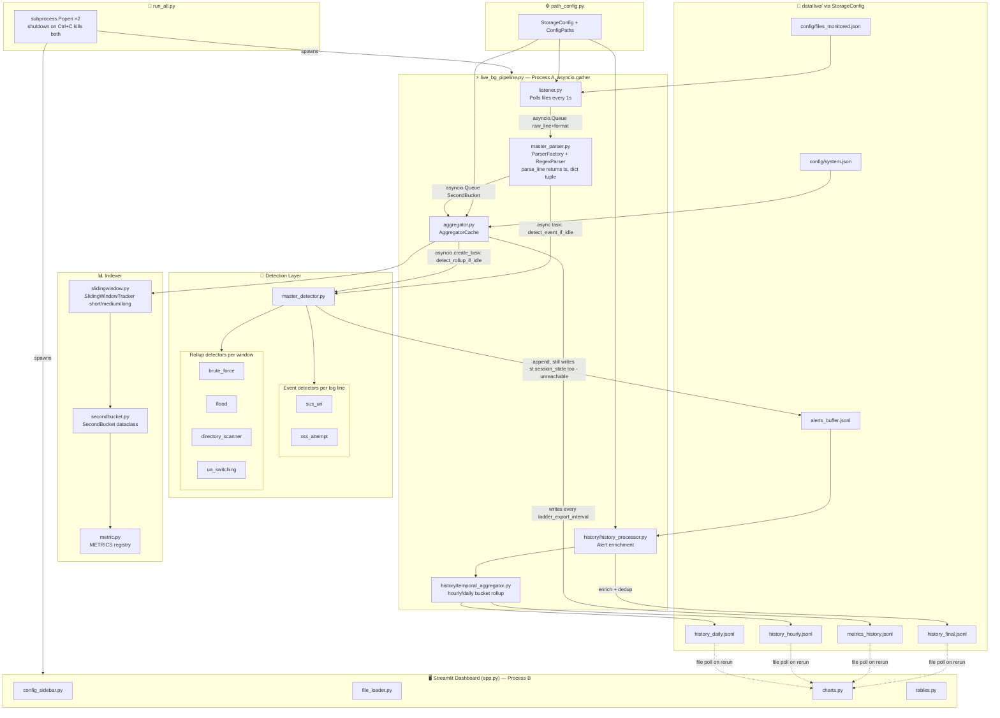

```mermaid
%%{init: { "theme": "default", "themeCSS": "svg { background: white !important; }" }}%%

graph TB

    subgraph Launcher["🚀 run_all.py"]
        RA[subprocess.Popen ×2\nshutdown on Ctrl+C kills both]
    end

    subgraph Dashboard["🖥️ Streamlit Dashboard  (app.py) — Process B"]
        CFG[config_sidebar.py]
        FL[file_loader.py]
        CH[charts.py]
        TB[tables.py]
    end

    subgraph Config["⚙️ path_config.py"]
        PC[StorageConfig + ConfigPaths]
    end

    subgraph Pipeline["⚡ live_bg_pipeline.py — Process A, asyncio.gather"]
        LS[listener.py\nPolls files every 1s]
        MP[master_parser.py\nParserFactory + RegexParser\nparse_line returns ts, dict tuple]
        AG[aggregator.py\nAggregatorCache]
        HP[history/history_processor.py\nAlert enrichment]
        TA[history/temporal_aggregator.py\nhourly/daily bucket rollup]
    end

    subgraph Detection["🚨 Detection Layer"]
        MD[master_detector.py]
        subgraph EventDet["Event detectors per log line"]
            SU[sus_uri]
            XS[xss_attempt]
        end
        subgraph RollupDet["Rollup detectors per window"]
            BF[brute_force]
            FL2[flood]
            DS[directory_scanner]
            UA[ua_switching]
        end
    end

    subgraph Indexer["📊 Indexer"]
        SW[slidingwindow.py\nSlidingWindowTracker short/medium/long]
        SB[secondbucket.py\nSecondBucket dataclass]
        MT[metric.py\nMETRICS registry]
    end

    subgraph Storage["💾 data/live/  via StorageConfig"]
        CFJ[config/files_monitored.json]
        SYS[config/system.json]
        BUF[alerts_buffer.jsonl]
        HIST[history_final.jsonl]
        MH[metrics_history.jsonl]
        HR[history_hourly.jsonl]
        DY[history_daily.jsonl]
    end

    RA -->|spawns| Pipeline
    RA -->|spawns| Dashboard
    PC --> LS
    PC --> AG
    PC --> HP
    CFJ --> LS
    SYS --> AG
    LS -->|asyncio.Queue raw_line+format| MP
    MP -->|asyncio.Queue SecondBucket| AG
    MP -->|async task: detect_event_if_idle| MD
    AG -->|asyncio.create_task: detect_rollup_if_idle| MD
    AG --> SW
    SW --> SB
    SB --> MT
    MD --> EventDet
    MD --> RollupDet
    MD -->|append, still writes st.session_state too - unreachable| BUF
    BUF --> HP
    HP -->|enrich + dedup| HIST
    HP --> TA
    TA --> HR
    TA --> DY
    AG -->|writes every ladder_export_interval| MH
    HIST -.->|file poll on rerun| CH
    MH -.->|file poll on rerun| CH
    HR -.->|file poll on rerun| CH
    DY -.->|file poll on rerun| CH
```