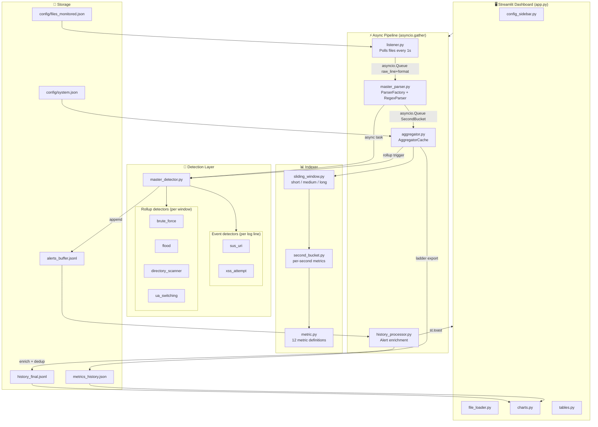

```mermaid
%%{init: { "theme": "default", "themeCSS": "svg { background: white !important; }" }}%%

graph TB

    subgraph Dashboard["🖥️ Streamlit Dashboard  (app.py)"]

        CFG[config_sidebar.py]

        FL[file_loader.py]

        CH[charts.py]

        TB[tables.py]

    end

    subgraph Pipeline["⚡ Async Pipeline  (asyncio.gather)"]

        LS[listener.py\nPolls files every 1s]

        MP[master_parser.py\nParserFactory + RegexParser]

        AG[aggregator.py\nAggregatorCache]

        HP[history_processor.py\nAlert enrichment]

    end

    subgraph Detection["🚨 Detection Layer"]

        MD[master_detector.py]

        subgraph EventDet["Event detectors (per log line)"]

            SU[sus_uri]

            XS[xss_attempt]

        end

        subgraph RollupDet["Rollup detectors (per window)"]

            BF[brute_force]

            FL2[flood]

            DS[directory_scanner]

            UA[ua_switching]

        end

    end

    subgraph Indexer["📊 Indexer"]

        SW[sliding_window.py\nshort / medium / long]

        SB[second_bucket.py\nper-second metrics]

        MT[metric.py\n12 metric definitions]

    end

    subgraph Storage["💾 Storage"]

        CFJ[config/files_monitored.json]

        SYS[config/system.json]

        BUF[alerts_buffer.jsonl]

        HIST[history_final.jsonl]

        MH[metrics_history.json]

    end

    CFJ --> LS

    SYS --> AG

    Dashboard --> Pipeline

    LS -->|asyncio.Queue raw_line+format| MP

    MP -->|asyncio.Queue SecondBucket| AG

    MP -->|async task| MD

    AG -->|rollup trigger| MD

    AG --> SW

    SW --> SB

    SB --> MT

    MD --> EventDet

    MD --> RollupDet

    MD -->|append| BUF

    BUF --> HP

    HP -->|enrich + dedup| HIST

    HP -->|st.toast| Dashboard

    AG -->|ladder export| MH

    HIST --> CH

    MH --> CH
```