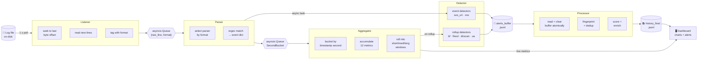

```mermaid
%%{init: {"theme": "default"}}%%

flowchart LR

    F[("📄 Log file\non disk")]

    subgraph Listener

        L1[seek to last\nbyte offset]

        L2[read new lines]

        L3[tag with format]

    end

    Q1{{"asyncio.Queue\n{raw_line, format}"}}

    subgraph Parser

        P1[select parser\nby format]

        P2[regex match\n→ event dict]

    end

    Q2{{"asyncio.Queue\nSecondBucket"}}

    subgraph Aggregator

        A1[bucket by\ntimestamp second]

        A2[accumulate\n12 metrics]

        A3[roll into\nshort/med/long\nwindows]

    end

    subgraph Detector

        D1[event detectors\nsus_uri · xss]

        D2[rollup detectors\nbf · flood · dirscan · ua]

    end

    AL[("📝 alerts_buffer\n.jsonl")]

    subgraph Processor

        H1[read + clear\nbuffer atomically]

        H2[fingerprint\n+ dedup]

        H3[score +\nenrich]

    end

    HIST[("📚 history_final\n.jsonl")]

    DASH["🖥️ Dashboard\ncharts + alerts"]

    F -->|1 s poll| Listener

    Listener --> Q1

    Q1 --> Parser

    Parser -->|async task| D1

    Parser --> Q2

    Q2 --> Aggregator

    Aggregator -->|on rollup| D2

    D1 --> AL

    D2 --> AL

    AL --> Processor

    Processor --> HIST

    HIST --> DASH

    Aggregator -->|live metrics| DASH
```