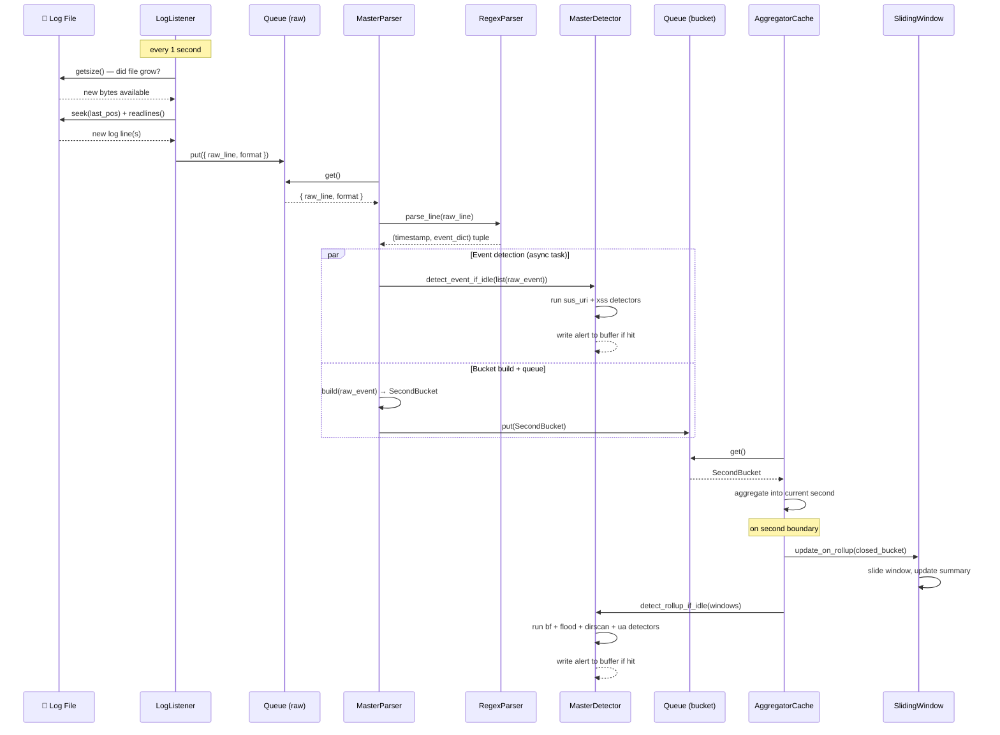

```mermaid
%%{init: { "theme": "default", "themeCSS": "svg { background: white !important; }" }}%%

sequenceDiagram

    participant File as 📄 Log File

    participant LS as LogListener

    participant Q1 as Queue (raw)

    participant MP as MasterParser

    participant RX as RegexParser

    participant MD as MasterDetector

    participant Q2 as Queue (bucket)

    participant AG as AggregatorCache

    participant SW as SlidingWindow

    Note over LS: every 1 second

    LS->>File: getsize() — did file grow?

    File-->>LS: new bytes available

    LS->>File: seek(last_pos) + readlines()

    File-->>LS: new log line(s)

    LS->>Q1: put({ raw_line, format })

    MP->>Q1: get()

    Q1-->>MP: { raw_line, format }

    MP->>RX: parse_line(raw_line)

    RX-->>MP: (timestamp, event_dict) tuple

    par Event detection (async task)

        MP->>MD: detect_event_if_idle(list(raw_event))

        MD->>MD: run sus_uri + xss detectors

        MD-->>MD: write alert to buffer if hit

    and Bucket build + queue

        MP->>MP: build(raw_event) → SecondBucket

        MP->>Q2: put(SecondBucket)

    end

    AG->>Q2: get()

    Q2-->>AG: SecondBucket

    AG->>AG: aggregate into current second

    Note over AG: on second boundary

    AG->>SW: update_on_rollup(closed_bucket)

    SW->>SW: slide window, update summary

    AG->>MD: detect_rollup_if_idle(windows)

    MD->>MD: run bf + flood + dirscan + ua detectors

    MD-->>MD: write alert to buffer if hit
```