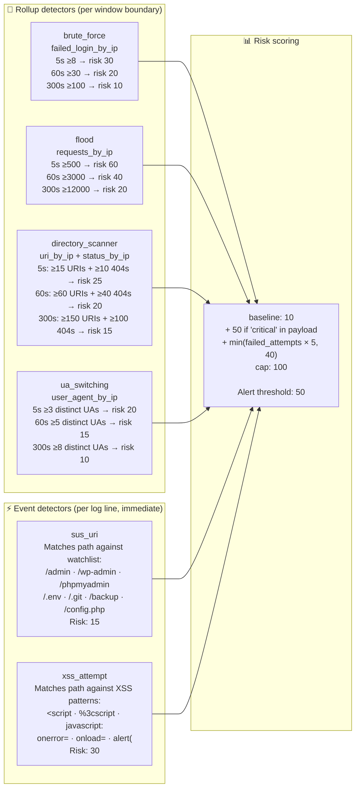

```mermaid
%%{init: { "theme": "default", "themeCSS": "svg { background: white !important; }" }}%%

graph LR

    subgraph Event["⚡ Event detectors  (per log line, immediate)"]

        SU["sus_uri<br>Matches path against watchlist:<br>/admin · /wp-admin · /phpmyadmin<br>/.env · /.git · /backup · /config.php<br>Risk: 15"]

        XS["xss_attempt<br>Matches path against XSS patterns:<br>&lt;script · %3cscript · javascript:<br>onerror= · onload= · alert(<br>Risk: 30"]

    end

    subgraph Rollup["🔁 Rollup detectors  (per window boundary)"]

        BF["brute_force<br>failed_login_by_ip<br>5s ≥8 → risk 30<br>60s ≥30 → risk 20<br>300s ≥100 → risk 10"]

        FL["flood<br>requests_by_ip<br>5s ≥500 → risk 60<br>60s ≥3000 → risk 40<br>300s ≥12000 → risk 20"]

        DS["directory_scanner<br>uri_by_ip + status_by_ip<br>5s: ≥15 URIs + ≥10 404s → risk 25<br>60s: ≥60 URIs + ≥40 404s → risk 20<br>300s: ≥150 URIs + ≥100 404s → risk 15"]

        UA["ua_switching<br>user_agent_by_ip<br>5s ≥3 distinct UAs → risk 20<br>60s ≥5 distinct UAs → risk 15<br>300s ≥8 distinct UAs → risk 10"]

    end

    subgraph Scoring["📊 Risk scoring"]

        SC["baseline: 10<br>+ 50 if 'critical' in payload<br>+ min(failed_attempts × 5, 40)<br>cap: 100<br><br>Alert threshold: 50"]

    end

    BF --> SC

    FL --> SC

    DS --> SC

    UA --> SC

    SU --> SC

    XS --> SC
```