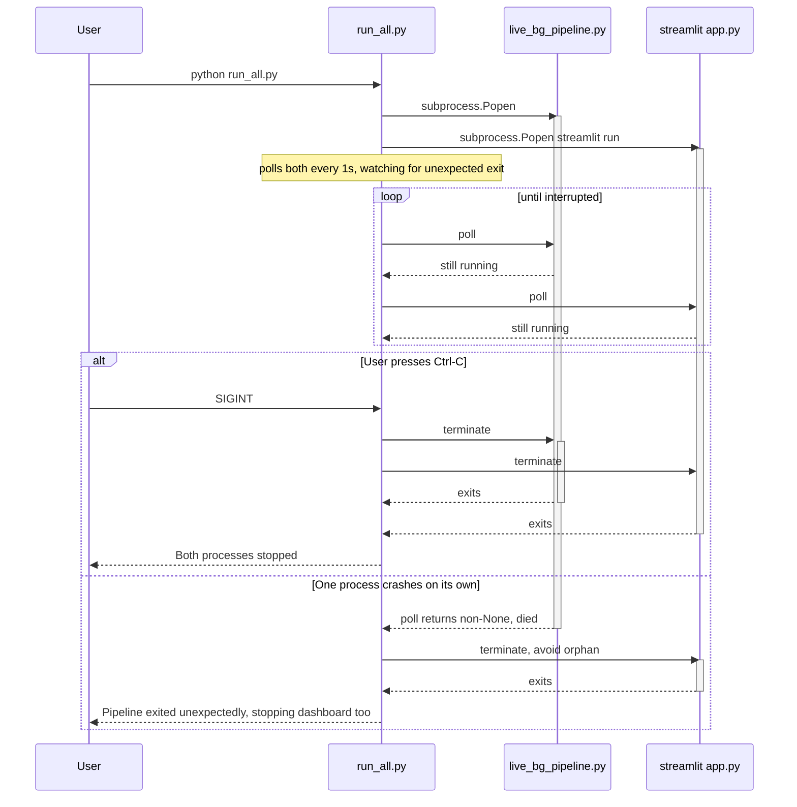

```mermaid
%%{init: { "theme": "default", "themeCSS": "svg { background: white !important; }" }}%%

sequenceDiagram

    participant User
    participant RA as run_all.py
    participant Pipe as live_bg_pipeline.py
    participant Dash as streamlit app.py

    User->>RA: python run_all.py

    RA->>Pipe: subprocess.Popen
    activate Pipe
    RA->>Dash: subprocess.Popen streamlit run
    activate Dash

    Note over RA: polls both every 1s, watching for unexpected exit

    loop until interrupted
        RA->>Pipe: poll
        Pipe-->>RA: still running
        RA->>Dash: poll
        Dash-->>RA: still running
    end

    alt User presses Ctrl-C
        User->>RA: SIGINT
        RA->>Pipe: terminate
        activate Pipe
        RA->>Dash: terminate
        Pipe-->>RA: exits
        deactivate Pipe
        Dash-->>RA: exits
        deactivate Dash
        RA-->>User: Both processes stopped
    else One process crashes on its own
        Pipe-->>RA: poll returns non-None, died
        deactivate Pipe
        RA->>Dash: terminate, avoid orphan
        activate Dash 
        Dash-->>RA: exits
        deactivate Dash
        RA-->>User: Pipeline exited unexpectedly, stopping dashboard too
    end
```