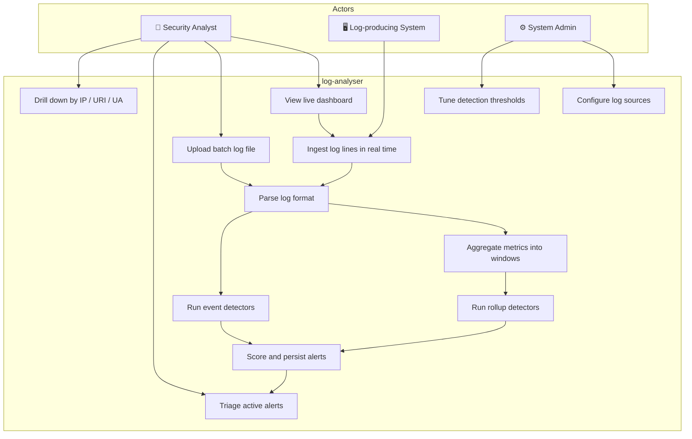

```mermaid
%%{init: { "theme": "default", "themeCSS": "svg { background: white !important; }" }}%%
graph TD
    subgraph Actors
        A[👤 Security Analyst]
        B[🖥️ Log-producing System]
        C[⚙️ System Admin]
    end
    subgraph log-analyser
        UC1[View live dashboard]
        UC2[Upload batch log file]
        UC3[Triage active alerts]
        UC4[Drill down by IP / URI / UA]
        UC5[Configure log sources]
        UC6[Tune detection thresholds]
        UC7[Ingest log lines in real time]
        UC8[Parse log format]
        UC9[Aggregate metrics into windows]
        UC10[Run event detectors]
        UC11[Run rollup detectors]
        UC12[Score and persist alerts]
    end
    A --> UC1
    A --> UC2
    A --> UC3
    A --> UC4
    C --> UC5
    C --> UC6
    B --> UC7
    UC1 --> UC7
    UC2 --> UC8
    UC7 --> UC8
    UC8 --> UC9
    UC8 --> UC10
    UC9 --> UC11
    UC10 --> UC12
    UC11 --> UC12
    UC12 --> UC3
```